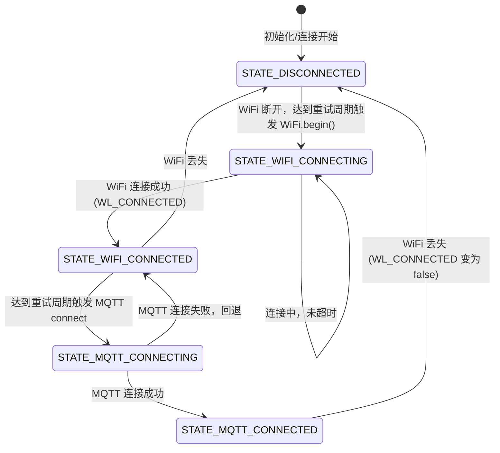

# ESP32 统一 WiFi/MQTT 连接管理库设计方案

本方案旨在设计并实现一个通用的 ESP32 WiFi 与 MQTT 连接管理类库 `ESP32WifiMqttManager`，用以整合 `water_relay`、`water_camera` 和 `water_sensor_touchpin` 三个项目中的网络连接与重连逻辑。

---

## 1. 目标与设计原则

1. **统一管理与共享**：抽取公共逻辑，发布至独立的 GitHub 仓库 [esp32_wifi_mqtt_manager](https://github.com/voicevon/esp32_wifi_mqtt_manager.git)，通过 Git Submodule 方式引入到各个项目中。
2. **WiFi 连通为基础**：MQTT 连接严格依赖 WiFi。只有在 WiFi 连通（`WL_CONNECTED`）时才进行 MQTT 连接和心跳维持；一旦 WiFi 断开，MQTT 立即执行清理并停止重连。
3. **无条件无限重连**：网络丢失后进行非阻塞的无限次重连（WiFi 默认 20 秒检测/重试一次，MQTT 默认 5 秒重试一次），直至连通。
4. **高内聚低耦合（解耦配置与业务）**：
   - 网络凭据、服务器地址和时间间隔均通过 `NetworkConfig` 结构体动态传入，库本身不硬编码任何具体项目的配置。
   - 库不包含任何具体的订阅主题。各个项目通过注册状态变化回调函数（`onStateChange`），在检测到 MQTT 连接成功（`STATE_MQTT_CONNECTED`）时，自行执行订阅逻辑。
5. **内建抗干扰与备用 DNS 解析**：集成 `water_camera` 中成熟的 DNS 解析机制，在遇到本地代理 Fake-IP 劫持或标准 DNS 解析失败时，通过阿里云的 HTTP-DNS（TCP 80 端口）进行域名 IP 解析。

---

## 2. 详细设计

### 2.1 状态枚举

定义统一的网络状态枚举，以便应用层更新指示灯或 UI 屏幕：

```cpp
enum NetworkState {
    STATE_DISCONNECTED,      // 完全断开（初始状态或网络彻底丢失）
    STATE_WIFI_CONNECTING,   // WiFi 正在尝试连接
    STATE_WIFI_CONNECTED,    // WiFi 已连接成功，MQTT 未连接
    STATE_MQTT_CONNECTING,   // WiFi 已连接，MQTT 正在尝试连接
    STATE_MQTT_CONNECTED     // WiFi 与 MQTT 均已成功连接
};
```

### 2.2 配置结构体

```cpp
struct NetworkConfig {
    const char* wifiSsid = nullptr;
    const char* wifiPassword = nullptr;
    const char* mqttBroker = nullptr;         // 支持域名或 IP
    uint16_t mqttPort = 1883;
    const char* mqttUsername = nullptr;       // 可选，无则传 nullptr
    const char* mqttPassword = nullptr;       // 可选，无则传 nullptr
    const char* clientIdPrefix = "ESP32Client"; // Client ID 前缀
    uint32_t wifiReconnectIntervalMs = 20000; // WiFi 断线重连检测周期（默认 20s）
    uint32_t mqttReconnectIntervalMs = 5000;  // MQTT 重连检测周期（默认 5s）
    bool useHttpDns = true;                   // 是否启用阿里云备用 HTTP-DNS 解析
};
```

### 2.3 类接口定义

```cpp
#ifndef ESP32_WIFI_MQTT_MANAGER_H
#define ESP32_WIFI_MQTT_MANAGER_H

#include <Arduino.h>
#include <WiFi.h>
#include <PubSubClient.h>
#include <functional>

class ESP32WifiMqttManager {
public:
    typedef std::function<void(NetworkState)> StateCallback;
    typedef std::function<void(char* topic, byte* payload, unsigned int length)> MqttMessageCallback;

    // 构造函数，需要传入一个 Client 实例（如 WiFiClient）以构造 PubSubClient
    ESP32WifiMqttManager(Client& netClient);

    // 初始化配置并开始连接流程
    void begin(const NetworkConfig& config);
    
    // 维持心跳与状态检测的核心循环，需在 Arduino 的 loop() 中非阻塞调用
    void loop();

    // 状态查询接口
    bool isConnected() const;       // WiFi 与 MQTT 均连通
    bool isWifiConnected() const;
    bool isMqttConnected() const;
    NetworkState getState() const;

    // 注册状态变化回调
    void onStateChange(StateCallback cb);

    // 注册 MQTT 消息接收回调
    void setMqttCallback(MqttMessageCallback cb);

    // 基础 MQTT 接口封装
    bool subscribe(const char* topic, uint8_t qos = 0);
    bool publish(const char* topic, const char* payload);
    bool publish(const char* topic, const uint8_t* payload, unsigned int plength, bool retained = false);

    // 流式大包（如图片）发布接口，直接映射 PubSubClient 的 Streaming API
    bool beginPublish(const char* topic, size_t totalLength, bool retained = false);
    size_t write(const uint8_t* buffer, size_t size);
    bool endPublish();

    // 获取底层 PubSubClient 实例
    PubSubClient& getMqttClient() { return _mqttClient; }

private:
    Client& _netClient;
    PubSubClient _mqttClient;
    NetworkConfig _config;
    NetworkState _state = STATE_DISCONNECTED;
    
    StateCallback _stateCb = nullptr;
    MqttMessageCallback _mqttCb = nullptr;

    uint32_t _lastWifiCheck = 0;
    uint32_t _lastMqttCheck = 0;
    IPAddress _resolvedBrokerIp;

    void updateState(NetworkState newState);
    void checkWiFi();
    void checkMQTT();
    IPAddress resolveBrokerIp(const char* host);
    static void staticMqttCallback(char* topic, byte* payload, unsigned int length);
};

#endif // ESP32_WIFI_MQTT_MANAGER_H
```

---

## 3. 非阻塞重连与状态机切换逻辑

### 3.1 `loop()` 环路状态转移图



### 3.2 域名解析与抗干扰 (HTTP-DNS)
在 `checkMQTT()` 中，若配置的 `mqttBroker` 为域名，首先尝试系统自带的 `WiFi.hostByName()` 进行常规 DNS 解析。
- 若解析出的 IP 处于局域网代理的 Fake-IP 范围（`198.18.x.x`）或解析失败，且配置中 `useHttpDns = true`，则库会非阻塞地向阿里云 HTTP-DNS 解析服务器（`223.5.5.5`）发送基于 HTTP-A 记录的解析请求，获取真实物理 IP，以此绕过本地网络中的 DNS 劫持。
